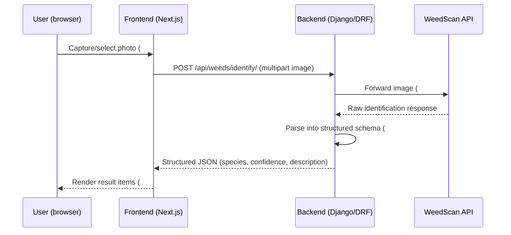

# AGENTS.md

Guidance for AI coding agents working on this repo. This is a Django + Next.js template
(see [README.md](README.md), [client/README.md](client/README.md), [server/README.md](server/README.md)
for setup/run instructions) being extended into an AI-powered weed identification tool for
volunteer park rangers (full product vision: GitHub issue #1).

**This document currently scopes the "weed identification" capture flow**
(GitHub issue #2 and its sub-issues #8, #9, #10, #11) **and the bushland map zoning data
source** (issues #3, #5, #6). Other planned features (ecology side menu popup UI, community
events, IAM) are tracked in issues #4, #7 but are **out of scope** for this doc — see
[Out of scope](#out-of-scope) below.

## Stack recap

- **Frontend** (`client/`): Next.js 15 (pages router), React 19, TypeScript (strict, `@/*` ->
  `./src/*`), Tailwind CSS, shadcn/ui components (`class-variance-authority` variants),
  TanStack React Query for data fetching, axios for HTTP. ESLint flat config + Prettier + Husky.
- **Backend** (`server/`): Django 5.1 + Django REST Framework, PostgreSQL, Poetry, Python 3.12.
  Linted with flake8 (`server/.flake8`, max-line-length 150), tested with pytest.
- **CI**: `.github/workflows/ci-frontend.yml` (format/lint/typecheck), `ci-backend.yml`
  (flake8 + pytest against a postgres service).

## Conventions to follow

- **New Django apps** live under `server/api/<app_name>/` and copy the structure of
  [server/api/healthcheck/](server/api/healthcheck/): `models.py`, `views.py` (DRF `@api_view`
  views), `urls.py` (`app_name = "<app_name>"` namespace), `admin.py`, `tests.py`,
  `migrations/`. Register the app in `INSTALLED_APPS` in
  [server/api/settings.py](server/api/settings.py) and `include()` its urls in
  [server/api/urls.py](server/api/urls.py).
- **Frontend data fetching** uses React Query hooks in `client/src/hooks/*.ts` that wrap the
  shared axios instance in [client/src/lib/api.ts](client/src/lib/api.ts), following the
  pattern in [client/src/hooks/pings.ts](client/src/hooks/pings.ts).
- **UI components** follow the shadcn/ui + `cva` variant pattern used in
  [client/src/components/ui/button.tsx](client/src/components/ui/button.tsx).
- Run `npm run lint:fix` and `npm run typecheck` (client) and keep flake8 clean (server)
  before committing.

## Feature skeleton: weed identification flow

Parent issue #2 (take a photo, verify via DL model) breaks down into four sub-issues:
#8 (image capture/upload), #9 (forward image to WeedScan API), #10 (menu for user to
cross-reference results), #11 (structure the API answer into frontend items).

Common backend/frontend scaffolding shared by all four sub-issues:

- New Django app `server/api/weeds/`, mirroring `healthcheck`: `models.py`, `serializers.py`,
  `views.py`, `urls.py` (`app_name = "weeds"`), `admin.py`, `tests.py`. Register `"api.weeds"`
  in `INSTALLED_APPS` and include its urls in [server/api/urls.py](server/api/urls.py).
- New React Query hooks in `client/src/hooks/weeds.ts`, reusing the axios instance in
  [client/src/lib/api.ts](client/src/lib/api.ts), following the pattern in
  [client/src/hooks/pings.ts](client/src/hooks/pings.ts).

### #8 — User image capture and upload

- **Frontend**: `client/src/components/weed-capture.tsx` — camera/file input widget for
  taking or selecting a photo; hands the file to a `useUploadWeedImage()` mutation.
- **Backend**: `views.py` `identify_weed` view accepts the multipart image upload. If images
  are persisted to the web store, add `MEDIA_ROOT`/`MEDIA_URL` settings and an `image` field
  on `WeedSighting` (see [Open questions](#open-questions)).

### #9 — Image forward to WeedScan API

- **Backend**: `services/weedscan_client.py` — thin wrapper around the external WeedScan API
  HTTP calls; reads `WEEDSCAN_API_KEY` / `WEEDSCAN_API_URL` from env (same dotenv pattern as
  [server/api/settings.py](server/api/settings.py)). `identify_weed` view calls this client
  and passes the raw response on for parsing.
- **Backend model**: `models.py` — `WeedSighting` (image reference, species_name, confidence,
  `raw_response` JSON as returned by WeedScan, created_at, optional user FK).

### #10 — Menu for user to cross-reference

- Issue body is currently empty — treat as **open question**: confirm with the issue author
  whether this means letting the user pick/confirm the correct species among multiple
  candidate matches WeedScan returns (e.g. when confidence is low or several species match).
- **Frontend** (tentative): a selection menu alongside `weed-results.tsx`, e.g.
  `client/src/components/weed-cross-reference-menu.tsx`, listing candidate species for the
  user to confirm.
- **Backend** (tentative): a `confirmed_species` field on `WeedSighting` distinct from
  WeedScan's top guess, plus an endpoint (e.g. `PATCH /api/weeds/<id>/confirm/`) to record
  the user's selection.

### #11 — Structured answer into frontend items

- **Backend**: `serializers.py` — `WeedSightingSerializer` / identification response
  serializer that shapes WeedScan's raw response into a stable schema (species_name,
  confidence, description, image_url) before returning it to the frontend.
- **Frontend**: `client/src/components/weed-results.tsx` — renders the structured list of
  identified species/confidence items, built with shadcn/ui components
  (`cva` pattern, see [client/src/components/ui/button.tsx](client/src/components/ui/button.tsx)).
- Wire capture → submit → results into a page (extend
  [client/src/pages/index.tsx](client/src/pages/index.tsx) or add a new
  `client/src/pages/identify.tsx`), following the existing hook/component integration style.

## Feature skeleton: bushland map zoning data (issues #3, #5, #6)

The interactive map viewer needs real bushland zone polygons to render and let users search
/click into. WA's [Bush Forever Areas 2000 (DOP-071)](https://catalogue.data.wa.gov.au/en/dataset/bush-forever-areas-2000-dop-071/resource/20db374b-fe7b-451a-a584-3f736fe46db4)
dataset (published via the SLIP WA `Property_and_Planning` ArcGIS `MapServer`) is a candidate
source for these zones. It's exposed as WMS (image tiles), WFS (vector `GetFeature`, GML/GeoJSON),
and an ArcGIS REST Feature Service (JSON `query` endpoint) — see the dataset's **Resources**
list for each endpoint URL.

A few implementation options, roughly in order of increasing effort/robustness:

1. **Direct frontend fetch + Leaflet** (simplest, good for a #5 prototype): call the ArcGIS
   Feature Service `query` endpoint with `f=geojson` directly from
   `client/src/components/bushland-map.tsx` (e.g. via `react-leaflet` + a `GeoJSON` layer),
   styling polygons by zone type and wiring `onEachFeature` clicks to open the ecology side
   menu (#7, out of scope here but the click hook belongs in this component). Downside: relies
   on CORS support and availability of the WA gov server at request time, and repeats the same
   query for every visitor.
2. **Backend proxy endpoint, no persistence** (middle ground for #6): a `views.py` endpoint in
   a new `server/api/bushland/` app (mirroring `healthcheck`) that server-side proxies the
   WFS/ArcGIS `query` request, forwards it as GeoJSON, and adds HTTP caching headers. Avoids
   CORS issues and hides the upstream URL, but still depends on the WA service being reachable.
3. **Backend sync + persistence** (recommended if #3's "search specific bushland" needs to
   filter/join against local data, e.g. ecology or weed sightings per zone): a management
   command (`server/api/bushland/management/commands/sync_bushland_areas.py`) that periodically
   fetches the WFS/ArcGIS response and upserts each polygon into a `BushlandArea` model —
   use GeoDjango's `PolygonField`/`MultiPolygonField` if PostGIS is enabled on the Postgres
   instance, otherwise store the raw GeoJSON geometry in a `JSONField` and do bounding-box
   filtering in Python. `BushlandArea` can then FK to `WeedSighting` and future ecology models.
   The dataset was last updated 2019, so a daily/weekly sync (not live polling) is sufficient.

Regardless of option chosen, keep the raw upstream response fields (name, reserve number,
zone category) alongside anything the app adds, so future ecology/events features (#4, #7)
can reference the same zone records.

## Open questions

- **WeedScan API contract** (auth method, request/response shape) is not yet known — fill in
  `weedscan_client.py` once API docs are available.
- **Image persistence**: whether uploaded photos are stored (Postgres path + object storage)
  or only forwarded transiently — decide before finalizing `models.py`.
- **Map viewer tech** (Leaflet vs Mapbox, etc.) and which of the three Bush Forever Areas
  endpoints (WMS/WFS/ArcGIS Feature Service) to standardise on are left open — see
  [Feature skeleton: bushland map zoning data](#feature-skeleton-bushland-map-zoning-data-issues-3-5-6).
- **Bush Forever Areas licence** is "Custom (Active Acceptance)" — confirm the acceptance
  terms are satisfied before relying on this dataset in production.
- **Cross-reference menu (#10)** has no issue description yet — the UX described above is a
  guess and should be confirmed before implementing.

## Out of scope

Not covered by this doc — see the linked issues for context when work begins on them:

- #1 — MVP umbrella (full product vision)
- #4 — community events (IAM dependent)
- #7 — ecology side menu popup UI (Figma dependent; only the click hook is sketched above)
- Full UI/UX of the map viewer itself (#5, #6) beyond the data-source options above
