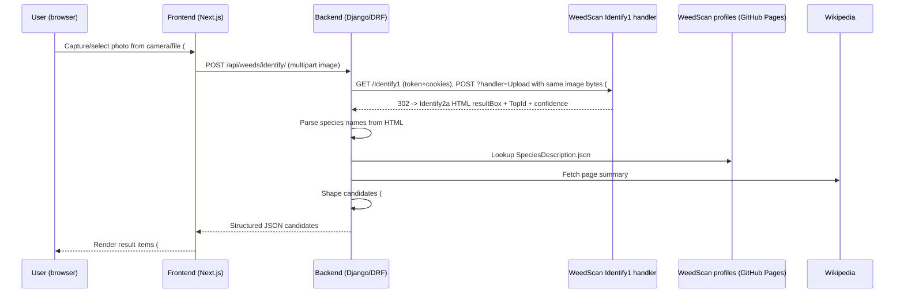

# AGENTS.md

Guidance for AI coding agents working on this repo. This is a Django + Next.js template
(see [README.md](README.md), [client/README.md](client/README.md), [server/README.md](server/README.md)
for setup/run instructions) being extended into an AI-powered weed identification tool for
volunteer park rangers (full product vision: GitHub issue #1).

**This document currently scopes only the "weed identification" capture flow**
(GitHub issue #2 and its sub-issues #8, #9, #10, #11). Other planned features (interactive
bushland map viewer, ecology side menu, community events, IAM) are tracked in issues #3–#7
but are **out of scope** for this doc — see [Out of scope](#out-of-scope) below.

## Stack recap

- **Frontend** (`client/`): Next.js 15 (pages router), React 19, TypeScript (strict, `@/*` ->
  `./src/*`), Tailwind CSS, shadcn/ui components (`class-variance-authority` variants),
  TanStack React Query for data fetching, axios for HTTP. ESLint flat config + Prettier + Husky.
- **Backend** (`server/`): Django 5.1 + Django REST Framework, PostgreSQL, Poetry, Python 3.12.
  Linted with flake8 (`server/.flake8`, max-line-length 150), tested with pytest.
- **CI**: `.github/workflows/ci-frontend.yml` (format/lint/typecheck), `ci-backend.yml`
  (flake8 + pytest against a postgres service).

## Conventions to follow

- **New Django apps** live under `server/api/<app_name>/` and copy the structure of
  [server/api/healthcheck/](server/api/healthcheck/): `models.py`, `views.py` (DRF `@api_view`
  views), `urls.py` (`app_name = "<app_name>"` namespace), `admin.py`, `tests.py`,
  `migrations/`. Register the app in `INSTALLED_APPS` in
  [server/api/settings.py](server/api/settings.py) and `include()` its urls in
  [server/api/urls.py](server/api/urls.py).
- **Frontend data fetching** uses React Query hooks in `client/src/hooks/*.ts` that wrap the
  shared axios instance in [client/src/lib/api.ts](client/src/lib/api.ts), following the
  pattern in [client/src/hooks/pings.ts](client/src/hooks/pings.ts).
- **UI components** follow the shadcn/ui + `cva` variant pattern used in
  [client/src/components/ui/button.tsx](client/src/components/ui/button.tsx).
- Run `npm run lint:fix` and `npm run typecheck` (client) and keep flake8 clean (server)
  before committing.

## Feature skeleton: weed identification flow

Parent issue #2 (take a photo, verify via DL model) breaks down into four sub-issues:
#8 (image capture/upload), #9 (forward image for identification), #10 (menu for user to
cross-reference results), #11 (structure the API answer into frontend items).

Key finding (verified live 2026-09-04, see `session.transcript`): `weedscan.org.au`
has **no public JSON identification API**, but the Razor handler
`POST /Identify1?handler=Upload` does work when called server-side with a valid
antiforgery token + cookies, and returns structured HTML (`resultBox` divs with
species name, confidence %, `TopId`). So #9 forwards the image to that handler,
parses the HTML to extract species names, then enriches each candidate with the
official WeedScan profile API + Wikipedia before returning them for user
confirmation (#10).

Common backend/frontend scaffolding shared by all four sub-issues:

- New Django app `server/api/weeds/`, mirroring `healthcheck`: `models.py`, `serializers.py`,
  `views.py`, `urls.py` (`app_name = "weeds"`), `admin.py`, `tests.py`. Register `"api.weeds"`
  in `INSTALLED_APPS` and include its urls in [server/api/urls.py](server/api/urls.py).
- New React Query hooks in `client/src/hooks/weeds.ts`, reusing the axios instance in
  [client/src/lib/api.ts](client/src/lib/api.ts), following the pattern in
  [client/src/hooks/pings.ts](client/src/hooks/pings.ts).

### #8 — User image capture and upload

- **Frontend**: `client/src/components/weed-capture.tsx` — camera/file input widget for
  taking or selecting a photo; hands the `File` to a `useUploadWeedImage()` mutation that
  POSTs it as multipart `image` to `/api/weeds/identify/`.
- **Backend**: `views.py` `identify_weed` view accepts the multipart image upload and passes
  the received image bytes straight through to the Identify1 handler in #9 (same file, no
  re-encoding). If images are persisted to the web store, add `MEDIA_ROOT`/`MEDIA_URL`
  settings and an `image` field on `WeedSighting` (see [Open questions](#open-questions)).

### #9 — Image identification via the Identify1 upload handler

- **Backend identifier**: `services/weedscan_identify.py` — server-side client for the
  Razor handler, called only from the backend (never the browser — CORS/CSRF blocked).
  Flow per the verified live test in `session.transcript` (30KB Rubber vine image →
  `TopId=24`, 80%):
  1. `GET https://weedscan.org.au/Identify1` with a cookie jar; extract the
     `__RequestVerificationToken` hidden input and keep the
     `.AspNetCore.Antiforgery.*` cookies.
  2. `POST https://weedscan.org.au/Identify1?handler=Upload` as multipart/form-data
     with fields `__RequestVerificationToken` and `Upload` (field name **must** be
     `Upload`; value is the exact image bytes received from the user's camera/file
     upload in #8; set `Origin`/`Referer` to `https://weedscan.org.au/Identify1`);
     follow the 302 to `Identify2a` (200 HTML, ~60KB).
  3. Parse the HTML: `TopId` hidden input, each `div.resultBox` →
     `<b>Common name (<i>Genus</i> <i>species</i>)</b>` + `div.colConfidence` %
     (colour bands: `#ffc400` <30% unreliable/no record, `#ff991f` 30–50% low,
     `#36b37e` 50–80% moderate, `#006644` >80% high; `<30%` renders
     "Unknown plant or not included in WeedScan"). Keep `TopId`/`SuggestedId` for the
     optional official-record step.
- **WeedScan enrichment** (official, lookup-only): base URL
  `https://centre-for-invasive-species-solutions.github.io/demo_json_api/` via
  `services/weedscan_profiles.py` — `GET /api.json` (weed list, cache 24h), then
  `GET /data/Species/{Family}/{Species}/SpeciesDescription.json` for
  `{ Family, ScientificName, CommonNames, PlantForm, DistinguishingFeatures, Impacts,
  Photos[] }`. Resolve `Family` from the extracted species name via `api.json`.
- **Wikipedia enrichment**: `services/wikipedia.py` —
  `GET https://en.wikipedia.org/api/rest_v1/page/summary/{ScientificName}` (fallback to
  `CommonNames`), returning extract + thumbnail + page URL.
- **Backend model**: `models.py` — `WeedSighting` (image reference, candidates JSON,
  top `scientific_name`, confidence, `weedscan_profile` JSON, `wikipedia_url`, created_at,
  optional user FK).

### #10 — Menu for user to cross-reference

- This is the confirm/correct step: the identifier returns several candidates, so the user
  picks the right one before a sighting is recorded.
- **Frontend**: `client/src/components/weed-cross-reference-menu.tsx` alongside
  `weed-results.tsx` — lists candidate species (name, confidence, thumbnail) for the user
  to confirm.
- **Backend**: a `confirmed_species` field on `WeedSighting` distinct from the top guess,
  plus an endpoint (e.g. `PATCH /api/weeds/<id>/confirm/`) to record the user's selection.

### #11 — Structured answer into frontend items

- **Backend**: `serializers.py` — `WeedSightingSerializer` / identification response
  serializer shaping each candidate into a stable schema: `scientificName`, `commonName`,
  `confidence`, `weedScanProfile`, `wikipediaExtract`, `wikipediaUrl`, `thumbnail`.
- **Frontend**: `client/src/components/weed-results.tsx` — renders the structured list of
  candidates, built with shadcn/ui components
  (`cva` pattern, see [client/src/components/ui/button.tsx](client/src/components/ui/button.tsx)).
- Wire capture → submit → results into a page (extend
  [client/src/pages/index.tsx](client/src/pages/index.tsx) or add a new
  `client/src/pages/identify.tsx`), following the existing hook/component integration style.

## Open questions

- **Licensed WeedScan endpoint**: contact `weeds@invasives.com.au` / CSIRO / Centre for
  Invasive Species Solutions about a WeedScan 2.0 model endpoint (`test.weedscan.org.au`
  advertises 950 plants / 900k images but publishes no API). Until then the Identify1
  handler works but is fragile HTML scraping — re-fetch `GET /Identify1` on 403/400
  (expired token), and expect breakage if the Razor page changes.
- **Image persistence**: whether uploaded photos are stored (Postgres path + object storage)
  or only forwarded transiently — decide before finalizing `models.py`.
- **Map viewer tech**: default to Leaflet (`react-leaflet`) unless vector-tile styling
  justifies MapLibre; see [Future work](#future-work-bushland-map-rendering-issues-56).
- **Cross-reference menu (#10)** has no issue description yet — the UX described above is a
  guess and should be confirmed before implementing.

## Future work: bushland map rendering (issues #5, #6)

Public dataset: [Bush Forever Areas 2000 (DPLH-019)](https://catalogue.data.wa.gov.au/en/dataset/bush-forever-areas-2000-dop-071/resource/20db374b-fe7b-451a-a584-3f736fe46db4)
(DataWA, SLIP Public Property and Planning Service). Exposes WMS, WFS, and ArcGIS
Map/Feature Server endpoints, e.g. WMS
`https://public-services.slip.wa.gov.au/public/services/SLIP_Public_Services/Property_and_Planning/MapServer/WMSServer`.
Licence is Custom (Active Acceptance), open data — retain attribution. Note it is a year-2000
snapshot; the current MRS Bush Forever overlay is authoritative for present-day boundaries.

Shared scaffold (all options): `client/src/components/bushland-map.tsx` (`MapContainer`
centred on Perth `[-31.953, 115.857]` over an OSM base layer), data via
`client/src/hooks/bushlands.ts` (React Query), polygon click selects an area for the ecology
side menu (#7) and search (#3). Get the exact WMS layer name / WFS typeName from the
service `GetCapabilities` before coding.

- **Option A — WMS raster overlay (fastest spike, frontend-only)**. Add `leaflet` +
  `react-leaflet`; render `WMSTileLayer` (`url`, `layers`, `format="image/png"`,
  `transparent`) over the base map; clicks via WMS `GetFeatureInfo`. No backend change.
  Pro: days of work, always fresh, no ETL. Con: raster only, limited styling, depends on
  SLIP uptime/CORS, no offline or spatial queries.
- **Option B — WFS / ArcGIS FeatureServer vector (interactive, still frontend-only)**.
  Fetch GeoJSON (`WFS GetFeature outputFormat=geojson` with bbox paging, or ArcGIS
  `.../query?where=1=1&outFields=*&f=geojson`), render as Leaflet `GeoJSON` layer with
  per-feature style and `onEachFeature` click handlers. Cache in React Query; simplify
  geometries for large responses. Pro: true vector interactivity/filtering. Con: large
  payloads, still externally dependent.
- **Option C — backend-cached PostGIS (production-ready)**. New `server/api/bushlands/`
  app with a `BushlandArea` model (`MultiPolygonField`, site id/name, `source_updated_at`)
  plus `import_bushforever` management command for the ETL snapshot; serve simplified
  `GET /api/bushlands/?bbox=` + detail endpoints from DRF. Requires `postgis` db image,
  `django.contrib.gis`, and GDAL. Pro: fast, offline-resilient, enables point-in-polygon
  joins (weed sightings per area). Con: heaviest setup and ETL maintenance.

## Out of scope

Not covered by this doc — see the linked issues for context when work begins on them:

- #1 — MVP umbrella (full product vision)
- #3, #4, #5, #6, #7 — interactive bushland map viewer, ecology side menu, community events
  (Figma/IAM dependent)
