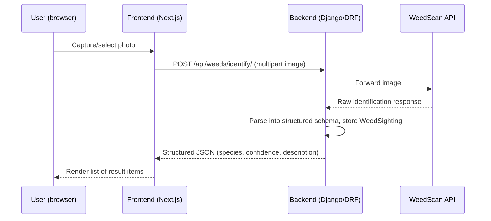

# AGENTS.md

Guidance for AI coding agents working on this repo. This is a Django + Next.js template
(see [README.md](README.md), [client/README.md](client/README.md), [server/README.md](server/README.md)
for setup/run instructions) being extended into an AI-powered weed identification tool for
volunteer park rangers (full product vision: GitHub issue #1).

**This document currently scopes only the "weed identification" capture flow**
(GitHub issues #2, #8, #9, #11). Other planned features (interactive bushland map viewer,
ecology side menu, community events, IAM) are tracked in issues #3–#7 and #10 but are
**out of scope** for this doc — see [Out of scope](#out-of-scope) below.

## Stack recap

- **Frontend** (`client/`): Next.js 15 (pages router), React 19, TypeScript (strict, `@/*` ->
  `./src/*`), Tailwind CSS, shadcn/ui components (`class-variance-authority` variants),
  TanStack React Query for data fetching, axios for HTTP. ESLint flat config + Prettier + Husky.
- **Backend** (`server/`): Django 5.1 + Django REST Framework, PostgreSQL, Poetry, Python 3.12.
  Linted with flake8 (`server/.flake8`, max-line-length 150), tested with pytest.
- **CI**: `.github/workflows/ci-frontend.yml` (format/lint/typecheck), `ci-backend.yml`
  (flake8 + pytest against a postgres service).

## Conventions to follow

- **New Django apps** live under `server/api/<app_name>/` and copy the structure of
  [server/api/healthcheck/](server/api/healthcheck/): `models.py`, `views.py` (DRF `@api_view`
  views), `urls.py` (`app_name = "<app_name>"` namespace), `admin.py`, `tests.py`,
  `migrations/`. Register the app in `INSTALLED_APPS` in
  [server/api/settings.py](server/api/settings.py) and `include()` its urls in
  [server/api/urls.py](server/api/urls.py).
- **Frontend data fetching** uses React Query hooks in `client/src/hooks/*.ts` that wrap the
  shared axios instance in [client/src/lib/api.ts](client/src/lib/api.ts), following the
  pattern in [client/src/hooks/pings.ts](client/src/hooks/pings.ts).
- **UI components** follow the shadcn/ui + `cva` variant pattern used in
  [client/src/components/ui/button.tsx](client/src/components/ui/button.tsx).
- Run `npm run lint:fix` and `npm run typecheck` (client) and keep flake8 clean (server)
  before committing.

## Feature skeleton: weed identification flow

Maps to issues #2 (take a photo, verify via DL model), #8 (image capture/upload), #9
(forward image to WeedScan API), #11 (structure the API answer into frontend items).

### Backend

- New app `server/api/weeds/`, mirroring `healthcheck`:
  - `models.py` — `WeedSighting` (image reference, species_name, confidence, raw_response
    JSON, created_at, optional user FK).
  - `serializers.py` — `WeedSightingSerializer` / identification response serializer.
  - `views.py` — `identify_weed` view accepting a multipart image upload, delegating to the
    WeedScan client, returning the structured response.
  - `urls.py` — `app_name = "weeds"`, e.g. `path("identify/", ...)`.
  - `admin.py`, `tests.py` — as per template.
  - `services/weedscan_client.py` — thin wrapper around the external WeedScan API HTTP calls;
    reads `WEEDSCAN_API_KEY` / `WEEDSCAN_API_URL` from env (same dotenv pattern as
    [server/api/settings.py](server/api/settings.py)).
- Register `"api.weeds"` in `INSTALLED_APPS` and include its urls in
  [server/api/urls.py](server/api/urls.py) alongside `healthcheck`.
- If uploaded images are persisted, add `MEDIA_ROOT`/`MEDIA_URL` settings (see
  [Open questions](#open-questions)).

### Frontend

- Reuse [client/src/lib/api.ts](client/src/lib/api.ts) as-is for the axios instance.
- New hook `client/src/hooks/weeds.ts` — `useIdentifyWeed()` as a React Query `useMutation`
  posting multipart form data to `/api/weeds/identify/`, following the pattern in
  `client/src/hooks/pings.ts`.
- New components:
  - `client/src/components/weed-capture.tsx` — camera/file input for photo capture (issue #8).
  - `client/src/components/weed-results.tsx` — renders the structured list of identified
    species/confidence items (issue #11).
- Wire capture → submit → results into a page (extend
  [client/src/pages/index.tsx](client/src/pages/index.tsx) or add a new
  `client/src/pages/identify.tsx`), following the existing hook/component integration style.

## Open questions

- **WeedScan API contract** (auth method, request/response shape) is not yet known — fill in
  `weedscan_client.py` once API docs are available.
- **Image persistence**: whether uploaded photos are stored (Postgres path + object storage)
  or only forwarded transiently — decide before finalizing `models.py`.
- **Map viewer tech** (Leaflet vs Mapbox, etc.) is left open for a future doc covering issues
  #3–#7.

## Out of scope

Not covered by this doc — see the linked issues for context when work begins on them:

- #1 — MVP umbrella (full product vision)
- #3, #4, #5, #6, #7 — interactive bushland map viewer, ecology side menu, community events
  (Figma/IAM dependent)
- #10 — cross-reference menu
